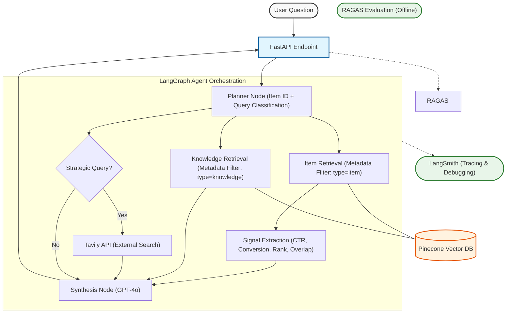
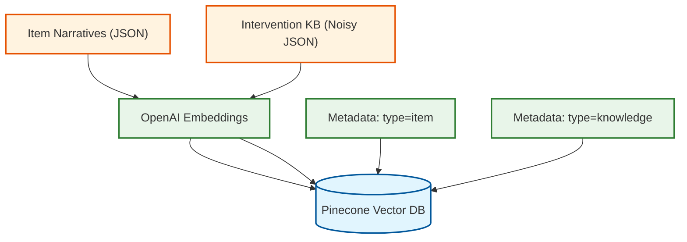

# LOOM
https://www.loom.com/share/a196cb1eba7145f2ae6226fa67efd228

# 🏗️ System Architecture: Agentic RAG for Diagnostics

This architecture leverages **LangGraph v0.6.7** to orchestrate a deterministic diagnostic flow, utilizing metadata-filtered retrieval and conditional external search.



------------------------------------------------------------------------

# 🧩 1. Defining the Problem, Audience, and Scope

## 🧠 1-Sentence Problem Statement

Retail merchants lack a structured, data-driven way to diagnose why an
item is underperforming, forcing them to rely on manual analysis and
intuition instead of systematic decision intelligence.

------------------------------------------------------------------------

## 👤 Target Audience

**Primary Users:**\
Retail Category Merchants / Merchandising Managers responsible for
assortment optimization and revenue performance.

------------------------------------------------------------------------

## 📉 Why This Is a Real Problem

Retail merchants are accountable for driving category growth, optimizing
assortment mix, and improving item-level performance. However,
diagnosing underperformance is complex. An item with low sales could be
suffering from:

-   Poor discoverability
-   Weak intrinsic demand
-   Cannibalization from similar SKUs
-   Pricing issues
-   Structural weakness

Each root cause requires a different intervention.

Today, merchants rely on fragmented dashboards, spreadsheets, and ad hoc
analysis. This creates:

-   Time-consuming manual investigation
-   Inconsistent diagnostic logic across teams
-   Risk of misclassification (e.g., delisting an item that simply needs
    visibility)
-   Reactive rather than structured decision-making

A systematic AI-driven diagnostic layer reduces cognitive load,
standardizes logic, and enables faster, evidence-based interventions.

------------------------------------------------------------------------

## 🎯 Scope of This Application

This system focuses specifically on diagnosing item underperformance
using:

-   **Visibility signals** --- impressions, rank, CTR
-   **Demand signals** --- conversion rate, sales volume
-   **Cannibalization signals** --- similarity overlap score
-   **Strategic risk framing** --- via external search context

### ❌ Out of Scope

This system does *not*:

-   Forecast demand
-   Optimize pricing
-   Manage supply chain
-   Execute operational interventions

It is a **decision-support diagnostic layer**, not an execution engine.

------------------------------------------------------------------------

# 🧪 Evaluation Question Set (Input--Output Pairs)

These represent realistic merchant queries used to test the system.

------------------------------------------------------------------------

## 1️⃣ Discoverability Scenario

**Input:**\
\> Diagnose ITEM_014 and recommend the best action.

**Expected Diagnosis Category:**\
Discoverability

**Expected Primary Action:**\
Re-ranking or increased exposure

------------------------------------------------------------------------

## 2️⃣ Demand Weakness Scenario

**Input:**\
\> Why is ITEM_021 underperforming despite strong impressions?

**Expected Diagnosis Category:**\
Demand Weakness

**Expected Primary Action:**\
Content, pricing, or value repositioning

------------------------------------------------------------------------

## 3️⃣ Cannibalization Scenario

**Input:**\
\> Is ITEM_032 suffering from cannibalization?

**Expected Diagnosis Category:**\
Cannibalization

**Expected Primary Action:**\
Assortment rationalization

------------------------------------------------------------------------

## 4️⃣ Structural Weakness Scenario

**Input:**\
\> What is wrong with ITEM_001?

**Expected Diagnosis Category:**\
Structural Weakness

**Expected Primary Action:**\
Deeper review or potential delisting test

------------------------------------------------------------------------

## 5️⃣ Strategic Query (Agent Behavior Test)

**Input:**\
\> What long-term strategic risk does ITEM_001 pose to category
performance?

**Expected Agent Behavior:**

-   Tavily external search invocation
-   Strategic risk framing
-   Structured diagnostic output including business risk commentary

------------------------------------------------------------------------

# 🛠️ 2. Solution

## 💡 Proposed Solution (1–2 Paragraphs)

To address the diagnostic gap faced by retail merchants, this project implements an **Agentic Retrieval-Augmented Generation (RAG) system** that combines deterministic signal extraction with structured knowledge retrieval and controlled LLM synthesis.

The system uses LangGraph to orchestrate a multi-step reasoning workflow: first extracting quantitative performance signals, then retrieving relevant diagnostic knowledge from a vector database, optionally invoking external strategic context, and finally synthesizing a structured, evidence-based recommendation. This architecture ensures that diagnoses are grounded in item-level data while leveraging domain knowledge to standardize intervention logic. The result is a reproducible, explainable decision-support layer rather than an unconstrained conversational system.

------------------------------------------------------------------------

## 🏗️ Infrastructure Overview

The system architecture is illustrated in the **Mermaid diagram** above. It consists of the following components:

- **Next.js Frontend** — User interface for submitting diagnostic queries.
- **FastAPI Backend** — Serves as the API layer connecting frontend requests to the agent.
- **LangGraph Orchestrator** — Manages deterministic node execution and conditional routing.
- **Pinecone Vector Database** — Stores item narratives and intervention knowledge with metadata filtering.
- **OpenAI GPT-4o** — Performs structured reasoning and synthesis.
- **Cohere Rerank (Advanced Retrieval)** — Improves context selection quality.
- **Tavily API** — Provides optional external strategic context.
- **RAGAS (Offline Evaluation)** — Quantitatively evaluates faithfulness, relevance, and recall.

### Tooling Rationale

- **LangGraph** — Chosen for explicit control over multi-step agent workflows.
- **Pinecone** — Enables scalable vector storage with metadata filtering for deterministic retrieval.
- **OpenAI Embeddings** — Provide semantic search capability for knowledge grounding.
- **Cohere Rerank** — Improves retrieval precision by reordering candidate chunks using cross-encoder scoring.
- **GPT-4o** — Balances reasoning quality and cost efficiency for structured synthesis.
- **FastAPI** — Lightweight, production-ready backend framework.
- **Next.js** — Simple, modern frontend framework for rapid deployment.
- **RAGAS** — Provides objective, repeatable evaluation of RAG performance.

------------------------------------------------------------------------

## 🔎 RAG vs Agent Components

### 📚 RAG Components

The Retrieval-Augmented Generation (RAG) layer consists of:

- Knowledge document embedding and indexing in Pinecone  
- Metadata-filtered similarity search  
- Cohere cross-encoder reranking  
- Context injection into the synthesis prompt  

This layer ensures that the model’s responses are grounded in retrieved evidence rather than parametric memory alone.

### 🤖 Agent Components

The agent layer consists of:

- Deterministic item ID extraction  
- Signal extraction from item narratives  
- Conditional routing (strategic vs operational query detection)  
- Optional Tavily external search invocation  
- Structured synthesis node execution  

Unlike a simple RAG pipeline, the agent enforces workflow control, ensuring reproducible reasoning steps before generation.

------------------------------------------------------------------------

# 📦 3. Dealing with the Data

## 🗂️ Data Sources and External APIs

## 🗃️ Data Model Overview



This system uses three primary data sources and one external API:

### 1️⃣ Item Performance Narratives (Synthetic Dataset)

- Contains structured textual descriptions of item-level performance.
- Includes quantitative signals such as impressions, rank, CTR, conversion rate, sales, and overlap score.
- Stored in JSON format and embedded into Pinecone with metadata tag `type=item`.

**Purpose:**  
Provides deterministic diagnostic signals used to extract structured performance metrics before synthesis.

---

### 2️⃣ Intervention Knowledge Base (Noisy Diagnostic KB)

- Contains domain knowledge articles describing intervention logic (re-ranking, delisting, promotion, cannibalization).
- Augmented with intentionally irrelevant noise documents to stress-test retrieval quality.
- Stored in JSON format and embedded into Pinecone with metadata tag `type=knowledge`.

**Purpose:**  
Acts as the grounding layer for RAG, enabling the model to anchor recommendations in explicit diagnostic logic rather than relying on parametric memory.

---

### 3️⃣ Pinecone Vector Database

- Stores embeddings for both item narratives and knowledge documents.
- Uses metadata filtering to separate `item` and `knowledge` retrieval paths.
- Supports top-k dense retrieval followed by reranking.

**Purpose:**  
Enables scalable semantic retrieval and structured context selection.

---

### 4️⃣ Tavily API (External Strategic Context)

- Invoked only for strategic queries (e.g., long-term risk framing).
- Provides external market or industry context.

**Purpose:**  
Expands the system beyond internal knowledge when strategic framing is required, while remaining optional and conditionally routed.

------------------------------------------------------------------------

## ✂️ Default Chunking Strategy

Knowledge base documents are chunked using:

- **Chunk Size:** 500 characters  
- **Chunk Overlap:** 100 characters  
- **Splitter:** RecursiveCharacterTextSplitter  

Item narratives are not aggressively chunked due to their small size and structured nature.

---

### 🧠 Why This Chunking Strategy?

The chunk size of 500 characters balances two competing objectives:

1. **Preserve semantic coherence** — Ensures that each chunk retains meaningful diagnostic logic.
2. **Enable precise retrieval** — Prevents large, overly broad documents from dominating similarity search results.

The 100-character overlap:

- Reduces boundary information loss.
- Preserves continuity of diagnostic rules across chunk splits.

This strategy ensures that retrieval quality remains sensitive to noise in the knowledge base, making reranking performance measurable and evaluation meaningful.

------------------------------------------------------------------------

# 🚀 4. Build End-to-End Prototype

An end-to-end prototype was built and deployed locally, consisting of:

- A Next.js frontend (user interface)
- A FastAPI backend (API layer)
- A LangGraph-based agent orchestration layer
- Pinecone vector storage
- Offline RAGAS evaluation scripts

The system supports full request–response flow from user input to structured diagnostic output.

------------------------------------------------------------------------

## 🏗️ Codebase Structure

The repository is organized to clearly separate baseline, improved, and evaluation components.

### 📁 Backend (Core Logic)

Location:
`backend/`

Contains:

- `main.py` — FastAPI application entry point
- `app/` — Agent logic and retrieval components
- `evals/` — RAGAS evaluation scripts
- `data/` — Synthetic datasets and knowledge base

---

### 🔹 Agent Versions

Two retrieval configurations are implemented for controlled experimentation:

- `backend/app/v1_baseline/`
  - `agent.py`
  - `retrievers.py`
  - Dense retrieval baseline

- `backend/app/v2_rerank/`
  - `agent.py`
  - `retrievers.py`
  - Dense retrieval + Cohere reranking

This separation enables clean evaluation comparisons without cross-contamination.

---

### 🔹 Data Layer

Location:
`backend/data/`

Includes:

- `item_cases_narrative.json` — Item performance narratives
- `intervention_kb.json` — Clean knowledge base
- `noisy_intervention_kb.json` — Noise-augmented KB
- `synthetic_evaluation_set.json` — Evaluation test cases

---

### 🔹 Evaluation Scripts

Location:
`backend/evals/`

- `run_ragas_v1.py` — Baseline evaluation
- `run_ragas_v2.py` — Rerank evaluation
- `results/` — Stored metric outputs (JSON + CSV)

This enables reproducible, offline metric comparison using RAGAS.

---

### 🎨 Frontend

Location:
`frontend/`

Built using Next.js.

Provides:

- Text input for item-level diagnostic queries
- Structured rendering of diagnostic output
- Localhost deployment at `http://localhost:3000`

------------------------------------------------------------------------

## ▶️ Local Deployment Instructions

### Backend

From project root:

```bash
uv run uvicorn backend.main:app --host 0.0.0.0 --port 10000
```

API available at:

```
http://0.0.0.0:10000/docs
```

---

### Frontend

From `frontend/` directory:

```bash
npm run dev
```

Frontend available at:

```
http://localhost:3000
```

---

## 🔁 End-to-End Flow

1. User submits diagnostic question in Next.js frontend.
2. FastAPI receives request and forwards to LangGraph agent.
3. Agent performs:
   - Item lookup
   - Signal extraction
   - Knowledge retrieval (with reranking in v2)
   - Optional Tavily external search
4. GPT-4o synthesizes structured diagnosis.
5. Response returned to frontend.
6. Offline evaluation conducted separately via RAGAS.

This confirms a fully functional, locally deployed, end-to-end diagnostic system.

------------------------------------------------------------------------

# 📊 5. Evaluation Using RAGAS

The system was evaluated using the **RAGAS framework**, measuring:

- Faithfulness
- Answer Relevancy
- Context Precision
- Context Recall

Evaluation was performed on a synthetic diagnostic question set using the baseline Dense retrieval pipeline.

------------------------------------------------------------------------

## 📈 Baseline Results (Dense Retrieval)

| Metric            | Score |
|-------------------|-------|
| Faithfulness      | 0.37  |
| Answer Relevancy  | 0.49  |
| Context Precision | 1.00  |
| Context Recall    | 0.79  |

------------------------------------------------------------------------

## 🔎 Baseline Interpretation

- **Context Precision (1.00)** — Retrieval was clean and did not introduce irrelevant documents.
- **Context Recall (0.79)** — Retrieval coverage was strong but not complete.
- **Faithfulness (0.37)** — The model occasionally over-generalized beyond retrieved evidence.
- **Answer Relevancy (0.49)** — Responses were moderately aligned but occasionally drifted.

### Key Insight

The system did **not** suffer from retrieval noise (precision was perfect).  
The primary limitation appeared to be:

- Context coverage gap
- Grounding and ranking quality
- Minor generative over-generalization

This suggested that improving retrieval ordering and coverage — rather than filtering noise — would likely yield measurable gains.

------------------------------------------------------------------------

# 🚀 6. Improving the Prototype

## 🔧 Advanced Retrieval Technique Selected

The system was enhanced using **Cohere cross-encoder reranking** via a `ContextualCompressionRetriever`.

This technique reorders retrieved chunks using a cross-encoder scoring model, allowing more precise semantic alignment between the query and candidate documents.

### Why This Was Appropriate

Because baseline precision was already 1.0, the issue was not noise — it was ranking quality and context coverage.  
Cross-encoder reranking improves selection of the *most semantically relevant* chunks before synthesis.

------------------------------------------------------------------------

## 🛠️ Implementation

The Dense retriever was wrapped with:

- Top-k dense retrieval from Pinecone
- Cohere `rerank-v3.5` cross-encoder
- Contextual compression before LLM synthesis

This configuration was implemented in:

`backend/app/v2_rerank/`

------------------------------------------------------------------------

## 📈 Performance Comparison

### Dense vs Dense + Rerank (Noisy KB)

| Metric            | Dense  | Dense + Rerank |     Δ     |
|-------------------|--------|----------------|-----------|
| Faithfulness      | 0.351  | 0.380          | 🔺 +0.029 |
| Answer Relevancy  | 0.513  | 0.509          | 🔻 -0.004 |
| Context Precision | 1.000  | 1.000          | ≈ same    |
| Context Recall    | 0.776  | 0.854          | 🔺 +0.078 |

------------------------------------------------------------------------

## 📊 Additional Experiment: Grounding Enforcement

A stricter prompt was introduced to enforce evidence-bound reasoning.

### Dense + Rerank + Grounded Prompt

| Metric            | Score  |
|-------------------|--------|
| Faithfulness      | 0.3696 |
| Answer Relevancy  | 0.4879 |
| Context Precision | 1.0000 |
| Context Recall    | 0.8000 |

------------------------------------------------------------------------

## 🔎 Interpretation of Improvements

### 1️⃣ Faithfulness Improved (+0.029)

The reranker produced a measurable lift in grounding quality.

### 2️⃣ Context Recall Improved Significantly (+0.078)

This indicates improved context coverage — the model received more relevant evidence.

### 3️⃣ Precision Remained Perfect

Metadata filtering combined with reranking preserved clean retrieval.

### 4️⃣ Relevancy Change Was Negligible

The slight decrease (-0.004) is statistically insignificant.

### Grounding Enforcement Observation

Strict evidence constraints slightly reduced measured relevance and recall, illustrating the trade-off between expressive generation and constrained grounding.

------------------------------------------------------------------------

## 🧠 Conclusion

Introducing Cohere cross-encoder reranking meaningfully improved retrieval quality. Compared to the baseline dense retrieval model (Faithfulness: 0.37, Relevancy: 0.49, Recall: 0.79), the Dense + Rerank configuration increased context recall to 0.85 while also slightly improving faithfulness (0.38) and answer relevancy (0.51).

The primary impact was improved recall, demonstrating that reranking more effectively surfaced semantically aligned knowledge chunks in the presence of noise.

Overall, the advanced retrieval technique enhanced the system’s ability to retrieve appropriate context, leading to more accurate and better-grounded diagnostic outputs.

------------------------------------------------------------------------

# 🔮 7. Next Steps

The current system uses **Dense Vector Retrieval + Cohere Reranking**, which demonstrably improved recall and grounding quality compared to baseline dense retrieval.

For Demo Day, I plan to retain the **Dense + Rerank configuration** because:

- It showed measurable improvement in context recall and faithfulness.
- Precision remained perfect (1.0), indicating stable retrieval quality.
- It provides a strong balance between performance gains and architectural simplicity.
------------------------------------------------------------------------